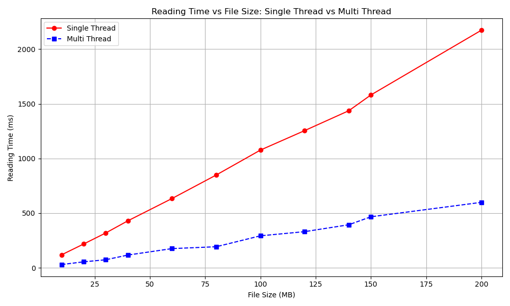

# Advanced_Multithreaded_File_Reader
## 📌 Project Goals

The primary goals of this project are:

- ✅ **Efficient Multi-threaded File Reading**:  
  To develop a multi-threaded file reader capable of handling large files by dividing the data into chunks and processing them in parallel.

- 💡 **Optimized I/O with Buffered Reading**:  
  To implement a buffered reading mechanism that minimizes I/O overhead and improves performance.

- 🔄 **Real-time File Modification Detection**:  
  To design a robust detection mechanism that monitors real-time file modifications without interrupting or corrupting the ongoing reading process.

- ⚙️ **Performance Benchmarking**:  
  To evaluate and compare the performance of the multi-threaded approach against a traditional single-threaded file reading approach.

## 📁 File Descriptions

- **`file_monitor.hpp`**  
  This header file is responsible for reading a file and detecting real-time changes in its content. It identifies and notifies which specific thread-handled chunks of the file have been modified.

- **`directory_monitor.cpp`**  
  This source file monitors the current directory for text files. It creates a new instance of the `FileChangeMonitor` class for each `.txt` file present. Additionally, it continuously observes the directory, and whenever a new text file is added, a corresponding new monitor instance is created automatically.

- **`multiple_thread.cpp`**  
  This file demonstrates multi-threaded file reading. It is used for performance benchmarking and comparison. In this version, hash calculation and real-time monitoring functionalities (originally from `file_monitor.hpp`) are removed to strictly focus on read speed.

- **`single_thread.cpp`**  
  This file implements the single-threaded approach for reading files. It is used to compare performance against the multi-threaded method.

  ## 🔄 Control Flow

The following outlines the control flow of the project:

1. **Directory Monitoring**  
   The `DirectoryMonitor` starts and begins watching the specified directory for text files.

2. **File Detection and Monitoring**  
   When a `.txt` file is detected, an instance of `FileChangeMonitor` is created for that file.

3. **File Chunking**  
   The file is divided into multiple chunks for parallel processing.

4. **Thread Assignment**  
   Worker threads are assigned to read and process individual chunks of the file.

5. **Real-time Monitoring**  
   A dedicated monitor thread continuously checks for modifications in the file.

6. **Handling Modifications**  
   When changes are detected:
   - a. Chunk boundaries are updated if the file size has changed.  
   - b. Only the affected chunks are re-read by the corresponding worker threads.  
   - c. All changes are logged and reported for visibility and debugging.
   
## 📊 Performance Analysis

### 5.1 Single-Threaded vs. Multi-Threaded Performance

The project includes both single-threaded (`single_thread.cpp`) and multi-threaded (`multiple_thread.cpp`) implementations to evaluate and compare file reading performance. Benchmark tests were conducted on files of varying sizes to analyze efficiency.

---

### 5.1.1 Performance Graphs

The following graphs illustrate the performance comparison:

- **Figure 4**: *Reading Time vs. File Size* — Single Thread vs. Multi Thread  

- **Figure 5**: *Speedup vs. File Size* — Single Thread vs. Multi Thread

#### 📝 Observations:

- 📈 **Figure 4** shows that reading time increases linearly with file size for both implementations. However, the rate of increase is significantly higher in the single-threaded reader compared to the multi-threaded one.

- 🚀 **Figure 5** demonstrates that the multi-threaded implementation achieves a speedup ranging from approximately **3.6× to 4.4×**, depending on the file size.

- ✅ Overall, the **multi-threaded approach consistently outperforms** the single-threaded version, with increasing advantages as file size grows. This highlights the substantial performance improvement gained through parallel processing.

